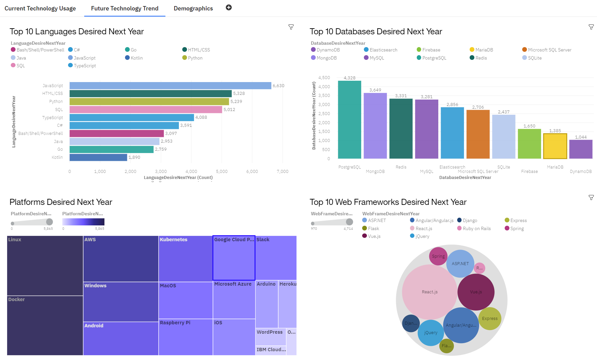

#  Data Dashboard

## The related online interactive dashboard can be accessed here: https://tinyurl.com/4c9szz63

### Table of Contents

1. [Project Motivation](#motivation)
2. [Description](#files)
3. [Findings](#findings)
4. [Screenshot of dashboard](#screenshot)
5. [Licensing, Authors, and Acknowledgements](#licensing)

## Project Motivation

I want to show that we can use data analysis to determine which IT skills will be in demand in the future.

## Description 

The file `capstone-presentation.pdf` contains a presentation about the demand for IT skills.
Data was collected from GitHub through web-scraping & downloaded from Stack OverFlow.
Data was wrangled using Python, Excel, and IBM Cognos Analytics.

## Findings 

IT skills that will be in demand:
- Languages: JavaScript, HTML/CSS & Python
- Databases: PostreSQL & MongoDB
- Webframes: React.js & Vue.js
- Platforms: Docker & AWS

The online interactive dashboard can be accessed here:
https://tinyurl.com/4c9szz63
There are three tabs, each containing four panels, that can be interacted with. 
These are fully described in the pdf.

## Screenshot of one tab of the dashboard 

  

## Licensing, Authors, and Acknowledgements 

Author: Dr. Renju Mathew.

Thanks to Coursera for the idea for this project, to Stack OverFlow for data, and to IBM for "IBM Cloud Pak for Data".
